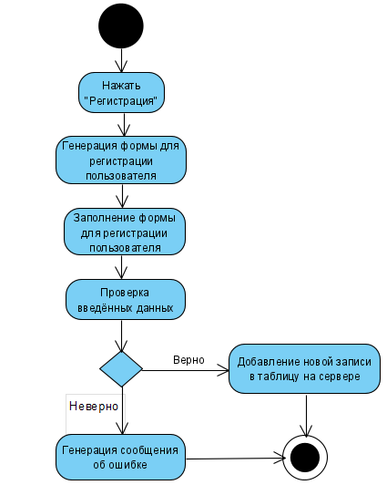
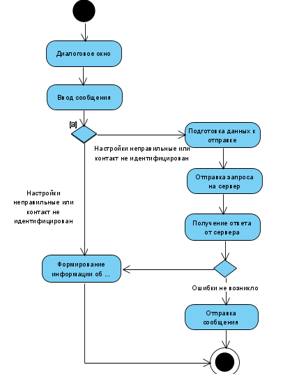
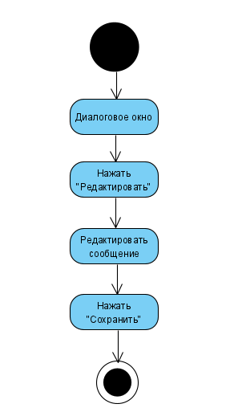

# Диаграмма активностей
---

# Содержание
1. [Регистрация пользователя](#1)
2. [Отправка сообщения](#2)
3. [Редактирование сообщения](#3)

### 1. Регистрация пользователя
При открытии файла пользователь видит окно программы, где пользователь нажимает кнопку Open. После этого приложение отображает список автомобилей в файловой системе. При нажатии кнопки Открыть приложение пытается открыть файл. При успешном открытии файл добавляется в список.

### 2. Отправка сообщения
Пользователь нажимает и удерживает выбранное в списке авто, после чего нажимает кнопку "Удалить".

### 3. Редактирование сообщения
Пользователь нажимает выбранную для редактирования задачу, после чего нажимает кнопку "Редактировать".

